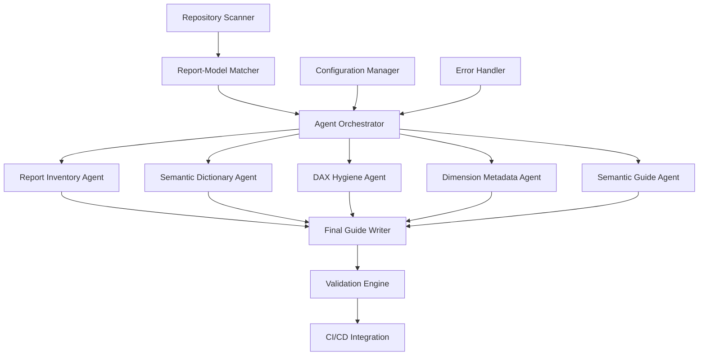
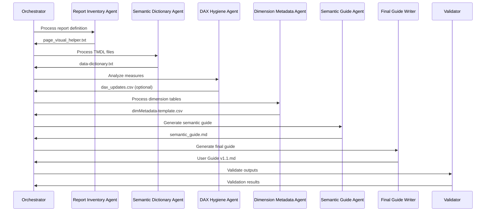
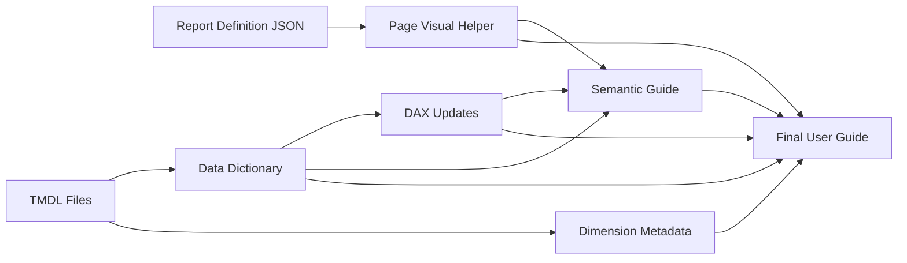

# Design Document

## Overview

The User Guide Automation system is a multi-agent orchestration platform that automatically generates comprehensive, publish-ready user guides for Fabric/Power BI repositories. The system follows a pipeline architecture where specialized agents process different aspects of the repository structure, culminating in a final documentation generation phase.

The system operates on PBIP/TMDL assets exclusively, ensuring vendor neutrality and avoiding dependencies on proprietary binary formats. It implements a discovery-first approach, automatically pairing reports with semantic models based on name proximity and field usage analysis.

## Architecture

### High-Level Architecture



### Agent Pipeline Flow



## Components and Interfaces

### 1. Repository Scanner

**Purpose:** Discovers and catalogs all reports and semantic models in the repository.

**Interface:**
```typescript
interface RepositoryScanner {
  scanRepository(rootPath: string): Promise<RepositoryStructure>;
  validateStructure(structure: RepositoryStructure): ValidationResult;
}

interface RepositoryStructure {
  reports: ReportDefinition[];
  semanticModels: SemanticModelDefinition[];
  rootPath: string;
}

interface ReportDefinition {
  name: string;
  path: string;
  definitionPath: string;
  outputDir: string;
}

interface SemanticModelDefinition {
  name: string;
  path: string;
  tmdlFiles: string[];
  captionsPath?: string;
}
```

### 2. Report-Model Matcher

**Purpose:** Pairs reports with their corresponding semantic models using name proximity and field usage analysis.

**Interface:**
```typescript
interface ReportModelMatcher {
  matchReportToModel(
    report: ReportDefinition, 
    models: SemanticModelDefinition[]
  ): Promise<ModelMatch>;
  
  calculateMatchScore(
    report: ReportDefinition, 
    model: SemanticModelDefinition
  ): Promise<number>;
}

interface ModelMatch {
  report: ReportDefinition;
  model: SemanticModelDefinition;
  confidence: number;
  matchingFields: string[];
}
```

### 3. Agent Orchestrator

**Purpose:** Coordinates the execution of specialized agents in the correct sequence.

**Interface:**
```typescript
interface AgentOrchestrator {
  processReportModelPair(match: ModelMatch): Promise<ProcessingResult>;
  executeAgent(agent: Agent, context: ProcessingContext): Promise<AgentResult>;
  validateIntermediateOutputs(outputs: AgentOutput[]): ValidationResult;
}

interface ProcessingContext {
  reportPath: string;
  modelPath: string;
  outputDir: string;
  variables: Record<string, string>;
}

interface AgentResult {
  agentName: string;
  outputFiles: string[];
  success: boolean;
  errors?: string[];
}
```

### 4. Specialized Agents

Each agent implements a common interface but processes different aspects of the repository:

**Base Agent Interface:**
```typescript
interface Agent {
  name: string;
  execute(context: ProcessingContext): Promise<AgentResult>;
  validate(output: string): ValidationResult;
}
```

**Report Inventory Agent:**
- Processes: `definition.json`, optional `cultures/en-US.tmdl`
- Outputs: `page_visual_helper.txt`
- Extracts: Pages, visuals, bindings, drillthrough targets

**Semantic Dictionary Agent:**
- Processes: All TMDL files in model definition
- Outputs: `data-dictionary.txt`
- Extracts: Tables, columns, measures with DAX, data types, formats

**DAX Hygiene Agent:**
- Processes: Measures from TMDL + data dictionary
- Outputs: `dax_updates.csv` (optional)
- Analyzes: Naming consistency, logic defects, unit mismatches

**Dimension Metadata Agent:**
- Processes: Table TMDL files
- Outputs: `dimMetadata-template.csv`
- Identifies: Dimension tables, keys, relationships

**Semantic Guide Agent:**
- Processes: All intermediate outputs + TMDL
- Outputs: `semantic_guide.md`
- Generates: Model summary, persona mapping, KPI descriptions

### 5. Final Guide Writer

**Purpose:** Synthesizes all intermediate outputs into a publish-ready user guide.

**Interface:**
```typescript
interface FinalGuideWriter {
  generateGuide(context: GuideContext): Promise<UserGuide>;
  applyTemplate(template: GuideTemplate, data: GuideData): string;
  validateGuide(guide: UserGuide): ValidationResult;
}

interface GuideContext {
  intermediateFiles: IntermediateFiles;
  outputPath: string;
  version: string;
  lastUpdated: string;
}

interface IntermediateFiles {
  pageVisualHelper: string;
  dataDictionary: string;
  daxUpdates?: string;
  dimMetadata: string;
  semanticGuide?: string;
}

interface UserGuide {
  content: string;
  metadata: GuideMetadata;
  appendices: GuideAppendix[];
}
```

### 6. Configuration Manager

**Purpose:** Manages system configuration and variable substitution.

**Interface:**
```typescript
interface ConfigurationManager {
  loadConfig(configPath?: string): Promise<SystemConfig>;
  resolveVariables(template: string, context: ProcessingContext): string;
  getOutputDirectory(report: ReportDefinition, config: SystemConfig): string;
}

interface SystemConfig {
  outputStrategy: 'adjacent' | 'centralized';
  centralizedPath?: string;
  fileEncoding: string;
  delimiter: string;
  versionFormat: string;
}
```

## Data Models

### Processing Pipeline Data Flow



### File Format Specifications

**page_visual_helper.txt:**
```
Page | VisualName | VisualType | Table | FieldOrMeasure | BindingRole | Extra
Overview | Sales Chart | ColumnChart | Sales | Revenue | Values | 
Overview | Sales Chart | ColumnChart | Date | Year | Axis |
Overview | KPI Card | Card | Sales | Total Sales | Values | Bookmark:Q1Focus
```

**data-dictionary.txt:**
```
EntityType | Table | Name | DataTypeOrReturn | Format | Description | Notes
Table | Sales | Sales | | | Sales transaction data |
Column | Sales | OrderDate | DateTime | mm/dd/yyyy | Date of sale transaction |
Measure | Sales | Total Revenue | Currency | $#,##0 | SUM(Sales[Revenue]) | Currency in USD
```

**dax_updates.csv:**
```
measure_name,current_name,proposed_name,change_type,reason,proposed_dax
Total Sales,Total Sales,Total Sales Amount,rename,Clarity - specify unit,SUM(Sales[Amount])
```

## Error Handling

### Error Categories and Responses

1. **Discovery Errors**
   - Missing report/model directories
   - Malformed definition files
   - Response: Log error, skip item, continue processing

2. **Matching Errors**
   - No semantic model found for report
   - Ambiguous matches with equal scores
   - Response: Use fallback matching strategy, log warning

3. **Agent Processing Errors**
   - TMDL parsing failures
   - Missing required fields
   - Response: Generate partial output, flag for manual review

4. **Validation Errors**
   - Schema violations
   - Missing required outputs
   - Response: Fail pipeline, provide detailed error report

5. **CI/CD Integration Errors**
   - Git operation failures
   - Validation pipeline failures
   - Response: Rollback changes, notify administrators

### Error Recovery Strategies

```typescript
interface ErrorHandler {
  handleDiscoveryError(error: DiscoveryError): RecoveryAction;
  handleAgentError(agent: string, error: AgentError): RecoveryAction;
  handleValidationError(error: ValidationError): RecoveryAction;
}

enum RecoveryAction {
  CONTINUE = 'continue',
  SKIP_ITEM = 'skip_item', 
  RETRY = 'retry',
  FAIL_PIPELINE = 'fail_pipeline'
}
```

## Testing Strategy

### Unit Testing

1. **Component Tests**
   - Repository scanner with mock file systems
   - Agent execution with sample TMDL/JSON files
   - Configuration manager with various config scenarios
   - Error handler with simulated failure conditions

2. **Agent-Specific Tests**
   - Report Inventory: Various report structures, missing captions
   - Semantic Dictionary: Complex DAX expressions, multiple cultures
   - DAX Hygiene: Edge cases in measure naming and logic
   - Dimension Metadata: Different relationship patterns

### Integration Testing

1. **Pipeline Tests**
   - End-to-end processing with sample repositories
   - Agent coordination and data flow validation
   - Error propagation and recovery testing

2. **File Format Tests**
   - Output file schema validation
   - Delimiter and encoding consistency
   - Cross-reference integrity between files

### System Testing

1. **Repository Scenarios**
   - Single report/model pairs
   - Multiple reports with shared models
   - Complex repository structures
   - Mixed PBIP/TMDL formats

2. **Performance Testing**
   - Large repository processing times
   - Memory usage with complex models
   - Concurrent processing capabilities

### Acceptance Testing

1. **Documentation Quality**
   - Generated guides match manual documentation
   - All report elements accurately represented
   - No placeholders or invented content

2. **CI/CD Integration**
   - Automated pipeline execution
   - Proper branch management and PR creation
   - Validation gate effectiveness

## Performance Considerations

### Optimization Strategies

1. **Parallel Processing**
   - Process multiple report/model pairs concurrently
   - Parallelize agent execution where dependencies allow
   - Implement work queues for large repositories

2. **Caching**
   - Cache parsed TMDL structures for reuse
   - Store intermediate results for incremental updates
   - Implement file change detection to avoid reprocessing

3. **Memory Management**
   - Stream large TMDL files instead of loading entirely
   - Implement garbage collection for intermediate objects
   - Use efficient data structures for field matching

4. **I/O Optimization**
   - Batch file operations where possible
   - Use async I/O for concurrent file processing
   - Implement connection pooling for repository access

### Scalability Targets

- Process repositories with 100+ reports in under 10 minutes
- Handle semantic models with 1000+ measures efficiently
- Support concurrent processing of 10+ repositories
- Maintain memory usage under 2GB for typical workloads